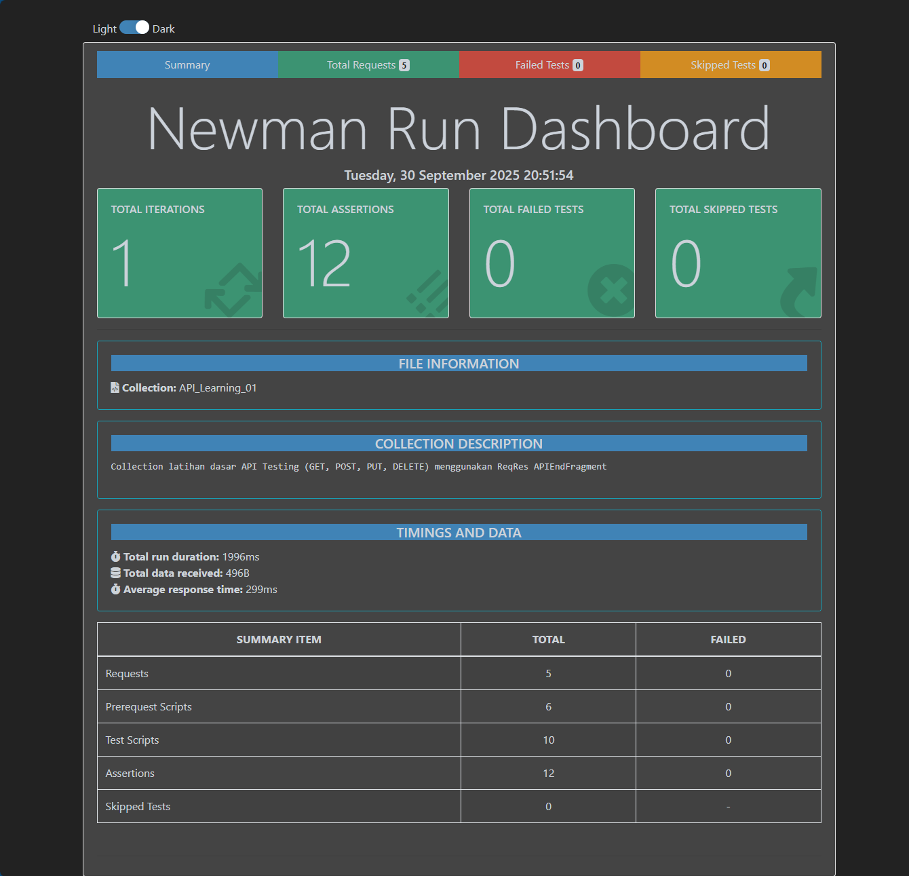
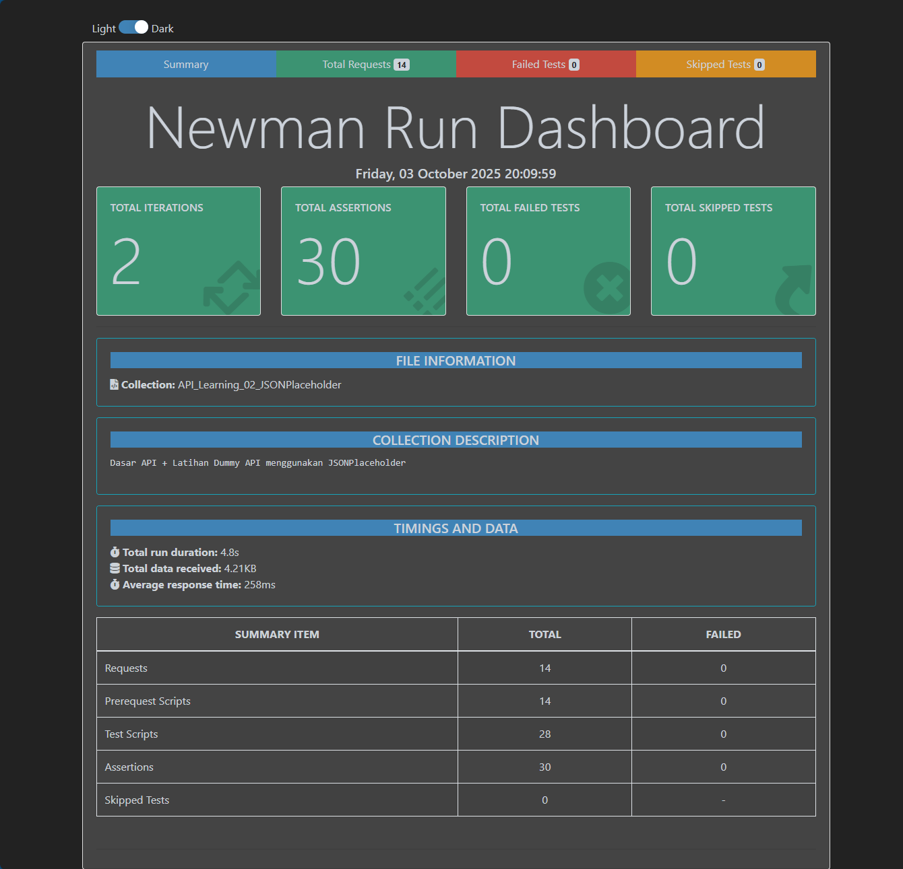

# 💻 QA Automation & API Testing

## 📌 Overview
Project ini mendokumentasikan perjalanan belajar **QA Automation & API Testing**.  
Tujuan project ini:
Membangun portofolio pembelajaran QA Automation & API Testing dari dasar **API**, **Automation tools**, **Integrasi CI/CD** hingga **end-to-end testing**.

---

## 📅 Progress Mingguan
- [Week 1 – Dasar API (HTTP, JSON, Postman)](./week1_reqres) ✅ → Dasar API (HTTP, JSON, Postman) 
- [Week 2 – Dasar API + latihan dummy API](./week2_jsonplaceholder/) ✅ → Dasar API + latihan dummy API 
- Week 3 – Automation tools (Selenium/RestAssured) (akan datang)  
- Week 4 – Mini project: API test suite (akan datang)  
- Week 5 – Framework testing sederhana (akan datang)  

---

## 🎯 Target Belajar
- Memahami dasar HTTP (method, status code) & JSON.
- Menggunakan Postman untuk membuat collection & assertion.
- Melakukan data-driven testing (CSV/JSON).
- Validasi schema respons API.
- Menjalankan test secara otomatis dengan Newman (CLI).
- Membuat report JSON/HTML hasil test.
- Integrasi dengan GitHub Actions (CI/CD).
- Chaining request (POST → GET → PUT → DELETE).
- Menguji API dengan autentikasi (Basic Auth, Bearer Token).
- Menangani negative test & error handling.  

---

## 📸 Report Preview

---

## ⚠️ Known Issues / Limitations
- ReqRes API kadang mengembalikan 429 Too Many Requests jika dipanggil dari GitHub Actions runner (karena public IP rate-limited).

---

## 📌 Tools
- **Postman** (API Platform)  
- **Excel** (Dataset)  
- **GitHub** (Version Control & Portfolio Hosting)  

---

✨ Stay tuned untuk update tiap minggu!  
