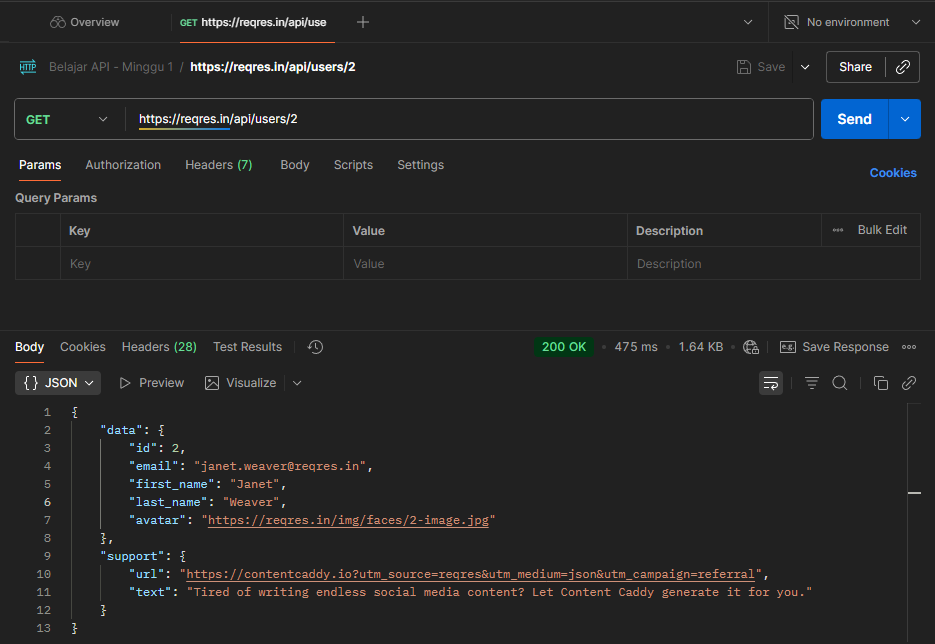
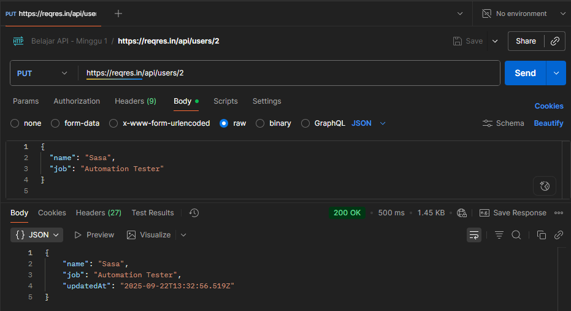
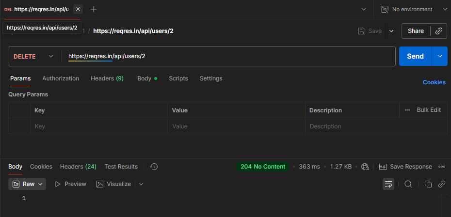

# API Testing with Postman – Dummy API (ReqRes)

## 📌 Overview
Project ini adalah latihan dasar API Testing menggunakan **Postman** dengan dummy API dari [ReqRes](https://reqres.in).  
Tujuan project ini:
- Memahami dasar **HTTP Methods** (GET, POST, PUT, DELETE).  
- Mengenal format request & response **JSON**.  
- Membuat collection Postman sebagai portofolio QA Automation.  

---

## 🛠️ Tools
- Postman v11.64.0
- Dummy API: https://reqres.in  

---

## 🚀 Test Cases
1. **GET** `/api/users/2` → Ambil data user dengan ID 2.  
2. **POST** `/api/users` → Tambah user baru dengan body JSON.  
3. **PUT** `/api/users/2` → Update data user dengan ID 2.  
4. **DELETE** `/api/users/2` → Hapus user dengan ID 2.  

---

## 📂 Test Collection
Collection berisi 4 request utama:
- `GET User`  
- `POST Create User`  
- `PUT Update User`  
- `DELETE User`  

---

## 📸 Screenshots
### 1. GET User

### 2. POST Create User

### 3. PUT Update User

### 4. DELETE User

---

## ✅ Result
- Semua request berhasil dengan status code **200/201/204** sesuai ekspektasi.  
- Response body JSON sesuai dokumentasi ReqRes.  

---

## 🔮 Next Step
- Integrasi test case ke dalam **automation framework** (RestAssured/Playwright).  
- Generate report hasil testing.  
- Publish project ke GitHub sebagai portofolio QA Automation.  
