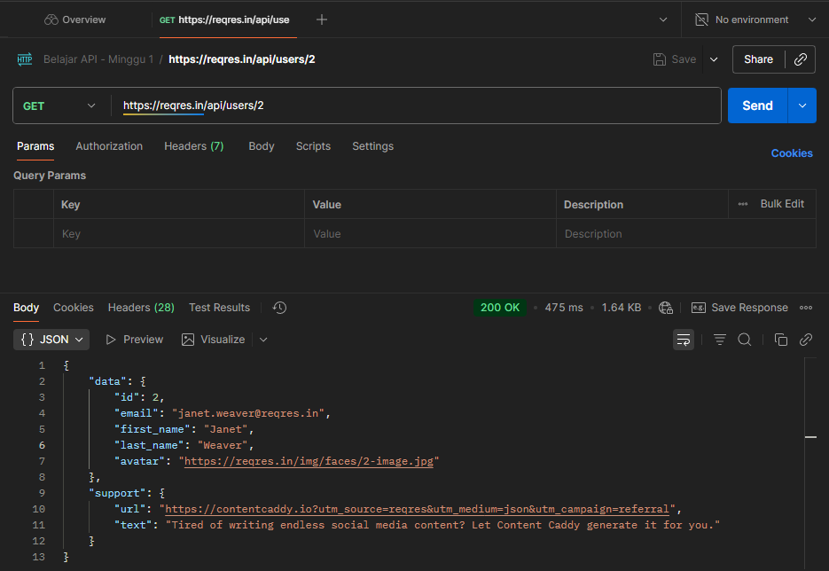
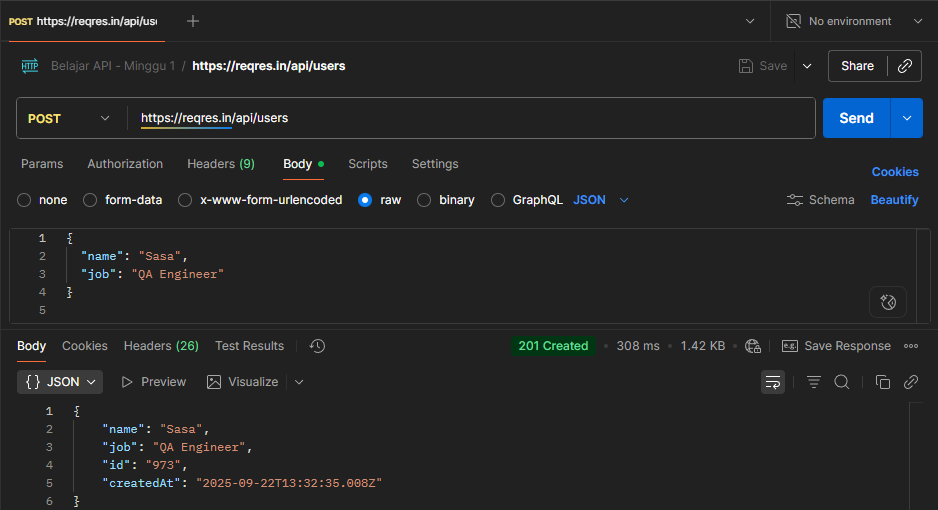
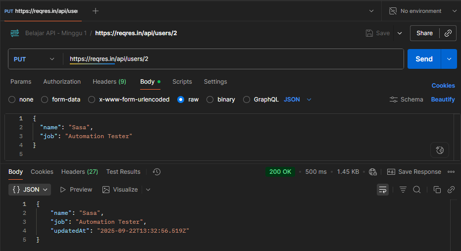
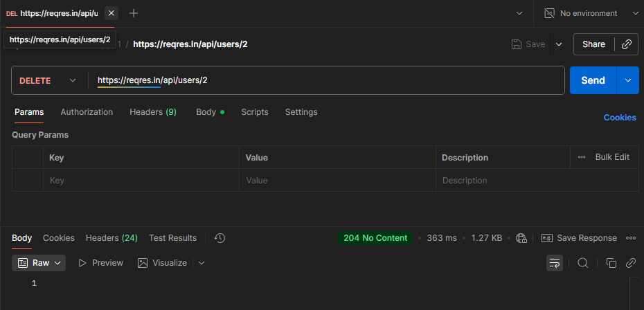

# API Testing with Postman – Dummy API (ReqRes)

## 📌 Overview
This project is a basic exercise of API Testing using **Postman** with dummy API from [ReqRes](https://reqres.in).  
Tujuan project ini:
- Understand the basics of **HTTP Methods** (GET, POST, PUT, DELETE).  
- Learn about **JSON** request and response formats.  
- Create a Postman collection as part of a **QA Automation portfolio**.  

---

## 🛠️ Tools
- Postman v11.64.0
- Dummy API: https://reqres.in  

---

## 🚀 Test Cases
1. **GET** `/api/users/2` → Get user data with ID 2.  
2. **POST** `/api/users` → Add new user with JSON body.  
3. **PUT** `/api/users/2` → Update user data with ID 2.  
4. **DELETE** `/api/users/2` → Delete user with ID 2.  

---

## 📂 Test Collection
Collection contains 4 main requests:
- `GET User`  
- `POST Create User`  
- `PUT Update User`  
- `DELETE User`  

---

## 📸 Screenshots
### 1. GET User


### 2. POST Create User


### 3. PUT Update User


### 4. DELETE User


---

## ✅ Result
- All requests returned **200/201/204** status codes as expected.  
- The JSON response body matched the API documentation. 

---

## 🧪 Postman Tests (Assertions)
In addition to sending requests, this collection also includes **automated tests** using Postman scripts.

Example (GET User):
```javascript
pm.test("Status code is 200", function () {
    pm.response.to.have.status(200);
});

pm.test("Response contains email field", function () {
    var jsonData = pm.response.json();
    pm.expect(jsonData.data).to.have.property("email");
});
```

---

## ▶️ Run with Newman
```bash
newman run API_Learning_01.postman_collection.json -r json --reporter-json-export responses/newman-results.json
```

---

## 🔮 Next Step
- Integrate the test cases into an **automation framework** (RestAssured/Playwright).  
- Generate detailed test result reports.  
- Publish the project on GitHub as part of the **QA Automation portfolio**.  
