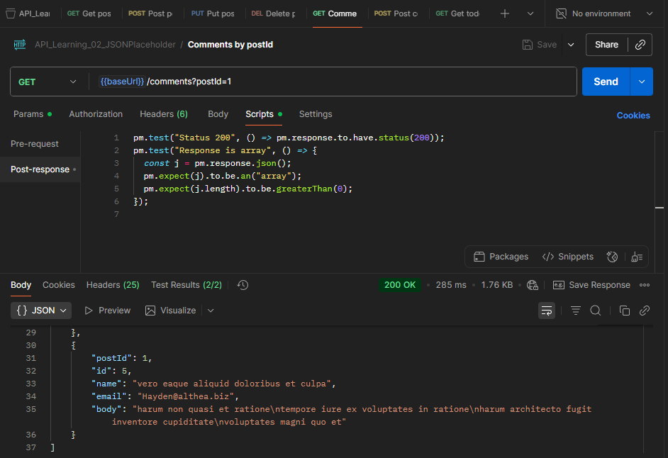
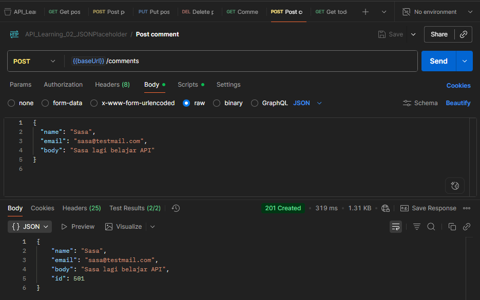
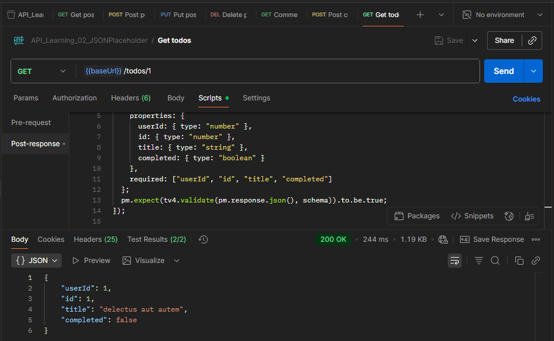

# API Testing with Postman – Dummy API (JSONPlaceholder)

## 📌 Overview
This project is a basic exercise of API Testing using **Postman** with dummy API from [JSONPlaceholder](https://jsonplaceholder.typicode.com).  
Project goals:
- Understand the basics of **HTTP Methods** (GET, POST, PUT, DELETE).  
- Learn about **JSON** request and response formats.  
- Create a Postman collection as part of a **QA Automation portfolio**.  

---

## 🛠️ Tools
- Postman v11.64.0
- Dummy API: https://jsonplaceholder.typicode.com

---

## 🚀 Test Cases
1. **GET** `/posts/1` → Get post data with ID 1.  
2. **POST** `/post` → Add new post with JSON body.  
3. **PUT** `/posts/1` → Update post data with ID 1.  
4. **DELETE** `/posts/1` → Delete post with ID 1.
5. **GET** `/comments?postId=1` → Get comment data form post with ID 1. 
6. **POST** `/post` → Add new comment with JSON body.  
7. **GET** `/todos/1` → Get to do data with ID 1. 

---

## 📂 Test Collection
Collection contains 7 main requests:
- `GET Post`  
- `POST Create Post`  
- `PUT Update Post`  
- `DELETE Post`  
- `GET Comment`  
- `POST Create Comment` 
- `GET To do`

---

## 📸 Screenshots
### 1. GET Post


### 2. PUT Update Post


### 3. DELETE Post


### 4. GET Comment


### 5. POST Comment


### 6. GET Todos


---

## ✅ Result


- All requests returned **200/201/204** status codes as expected.  
- The JSON response body matched the API documentation. 

---

## 🧪 Postman Tests (Assertions)
In addition to sending requests, this collection also includes **automated tests** using Postman scripts.

Example (GET Post):
```javascript
pm.test("Status 200", ()=> pm.response.to.have.status(200));
pm.test("JSON response", ()=> pm.response.to.be.json);
pm.test("Has title", ()=> {
  const j = pm.response.json();
  pm.expect(j).to.have.property("title");
});
```

---

## ▶️ Run with Newman
```bash
newman run API_Learning_02_JSONPlaceholder.postman_collection.json --iteration-data data/posts.csv -r cli,json,htmlextra --reporter-json-export responses/newman-results.json --reporter-htmlextra-export responses/newman-report.html
```

---

## 🔮 Next Step
- Integrate the test cases into an **automation framework** (RestAssured/Playwright).  
- Generate detailed test result reports.  
- Publish the project on GitHub as part of the **QA Automation portfolio**. 
