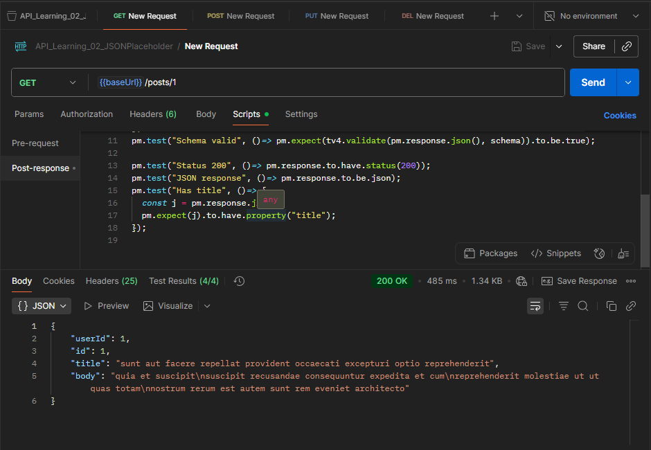
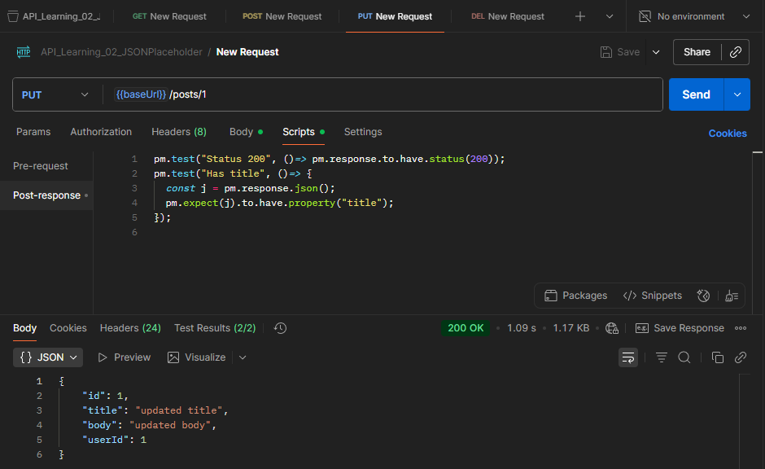
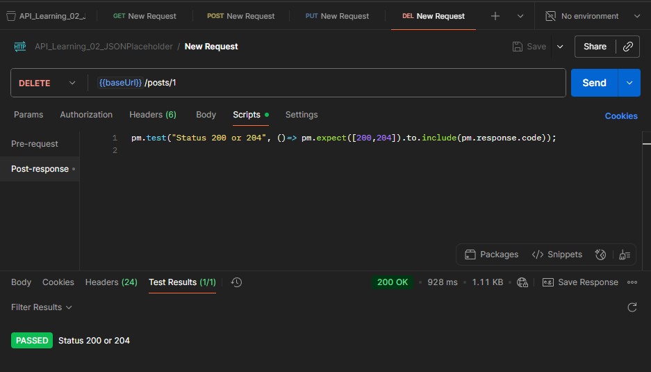
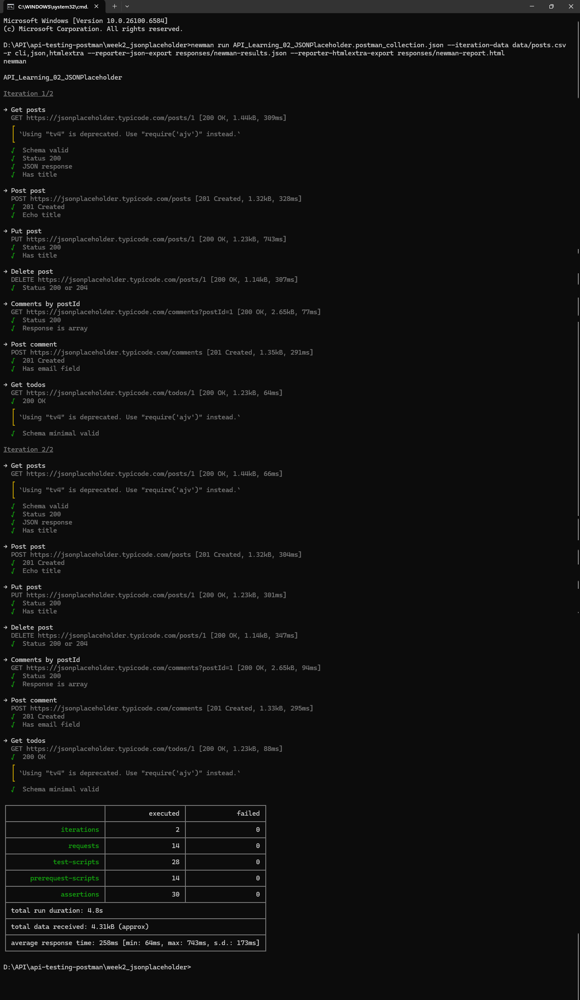

# API Testing with Postman – Dummy API (JSONPlaceholder)

## 📌 Overview
Project ini adalah latihan dasar API Testing menggunakan **Postman** dengan dummy API dari [JSONPlaceholder](https://jsonplaceholder.typicode.com).  
Tujuan project ini:
- Memahami dasar **HTTP Methods** (GET, POST, PUT, DELETE).  
- Mengenal format request & response **JSON**.  
- Membuat collection Postman sebagai portofolio QA Automation.  

---

## 🛠️ Tools
- Postman v11.64.0
- Dummy API: https://jsonplaceholder.typicode.com

---

## 🚀 Test Cases
1. **GET** `/posts/1` → Ambil data post dengan ID 1.  
2. **POST** `/post` → Tambah post baru dengan body JSON.  
3. **PUT** `/posts/1` → Update data post dengan ID 1.  
4. **DELETE** `/posts/1` → Hapus post dengan ID 1.  

---

## 📂 Test Collection
Collection berisi 4 request utama:
- `GET Post`  
- `POST Create Post`  
- `PUT Update Post`  
- `DELETE Post`  

---

## 📸 Screenshots
### 1. GET Post


### 2. PUT Update Post


### 3. DELETE Post


---

## ✅ Result



- Semua request berhasil dengan status code **200/201/204** sesuai ekspektasi.  
- Response body JSON sesuai dokumentasi.  

---

## 🧪 Postman Tests (Assertions)
Sebagai tambahan dari mengirim request, collection ini juga mencakup **automated tests** menggunakan script Postman.

Contoh (GET Post):
```javascript
pm.test("Status 200", ()=> pm.response.to.have.status(200));
pm.test("JSON response", ()=> pm.response.to.be.json);
pm.test("Has title", ()=> {
  const j = pm.response.json();
  pm.expect(j).to.have.property("title");
});
```

---

## ▶️ Run with Newman
```bash
newman run API_Learning_02_JSONPlaceholder.postman_collection.json --iteration-data data/posts.csv -r cli,json,htmlextra --reporter-json-export responses/newman-results.json --reporter-htmlextra-export responses/newman-report.html
```

---

## 🔮 Next Step
- Integrasi test case ke dalam **automation framework** (RestAssured/Playwright).  
- Generate report hasil testing.  
- Publish project ke GitHub sebagai portofolio QA Automation.  
