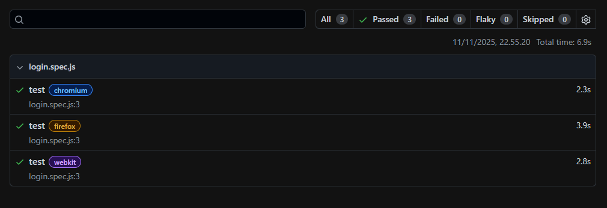

# Automation Testing with Playwright – Dummy Login (saucedemo)

## 📌 Overview
This project is a basic exercise of Automation Testing using **Playwright** with dummy login system from [saucedemo](https://www.saucedemo.com/).  
Project goals:
- Understand the basics of **Automation Testing**.  
- Learn about **Playwright** for automation.  
- Create a test case as part of a **QA Automation portfolio**.  

---

## 🛠️ Tools
- Playwright v1.56.1
- Dummy system: https://saucedemo.com

---

## 🚀 Test Cases
1. Go to https://saucedemo.com
2. Insert username
3. Insert password
4. Click login
5. Redirecting to page inventory

---

## ✅ Result

- All requests returned **passed** status as expected.

---

## 🔮 Next Step
- Mini project: **API test suite**
